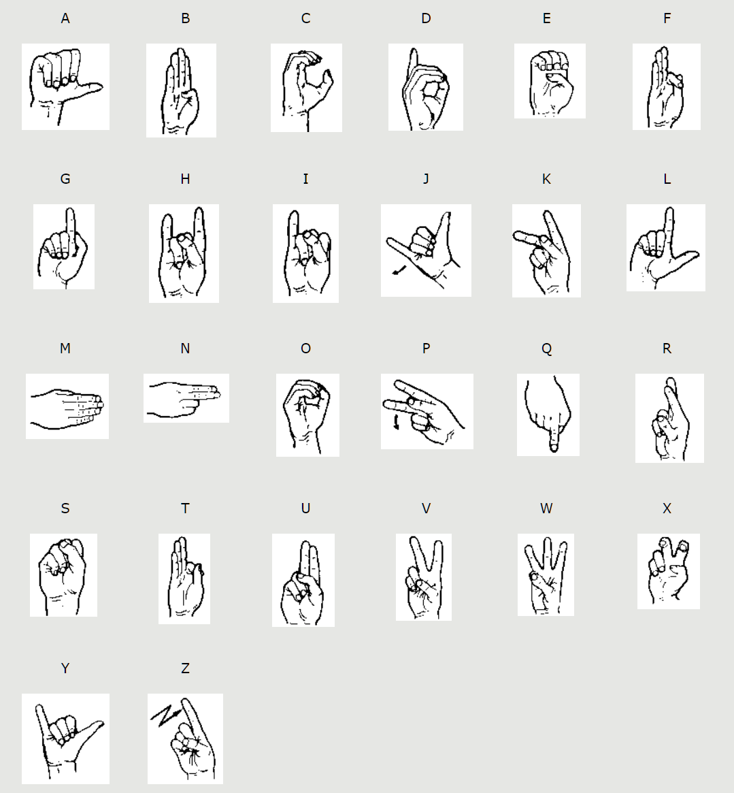
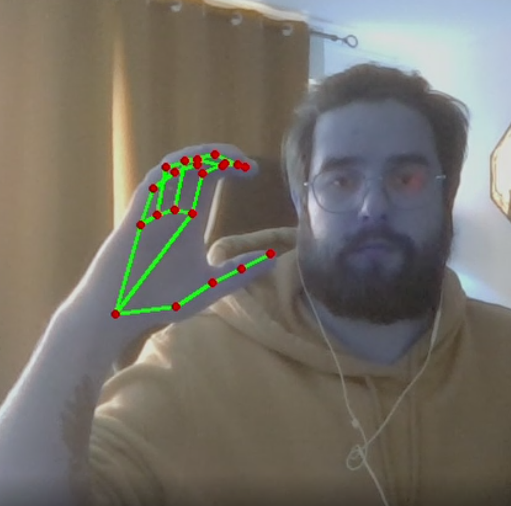
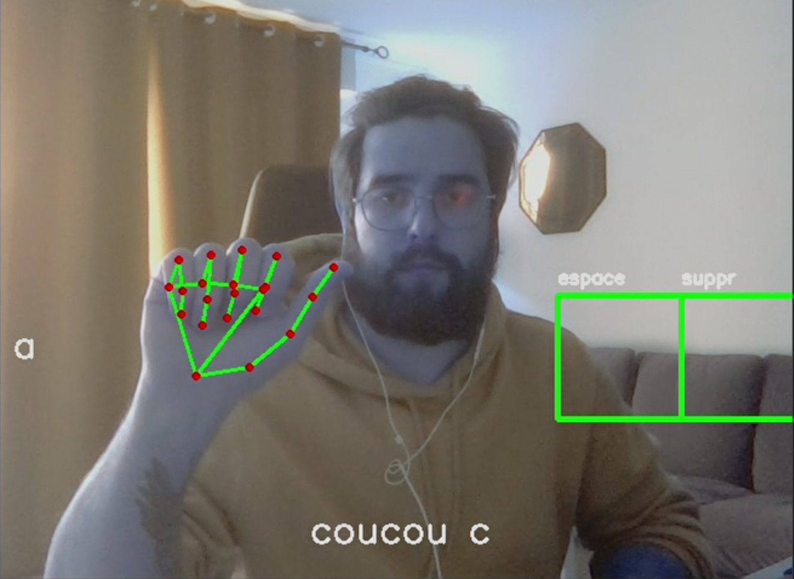

# Sign detection and classification

The objective of this project is to make a program that can detect and recognize sign language. To do that, we had to create an entire dataset of people doing the following alphabet in sign language. 



## Dataset creation

To create the picture dataset, we created a python script with openCV to get pictures from our webcam. The resulting dataset is available [here](https://drive.google.com/drive/folders/1u8Hnd8CNCW26xyqQBYZprVFPRwkOzoWM?usp=sharing) 

### Python script

```python
import cv2

cap = cv2.VideoCapture(0) 

i=0
while cap.isOpened():
    ret, image = cap.read()
    i+=1

        

    cv2.imshow('image',image)
    # Save a capture when we press "w"
    if cv2.waitKey(25) & 0xFF == ord('w'):

        cv2.imwrite(f'images/unlabelled/frame_{i}.jpg',image)
    if cv2.waitKey(25) & 0xFF == ord('q'):
        cap.release()
        cv2.destroyAllWindows()
        break
```

### Hand position for classification

The next idea was to use [Google's Mediapipe](https://github.com/google/mediapipe) to get the relative hand position. With this package, we were able to get 21 keypoints position for the right hand.




Once the keypoints position recuperation done, we just had to walk througt our previously created picture to get all the hand position for every letter. All those position are stored in the [labelleled position csv](https://github.com/FurigaJulien/sign_detection_classification/blob/main/labellised_data.csv)

## Classification

To do the classification, we used a fully connected network with 4 dense layers. Although the accuracy was only 60%, it is enought to have good result after. In fact some sign are really similar and it was predictible that we had such results.

## Detection and writing

With our model, we are now able to get real time hand keypoint position to predict what sign the hand is doing. To have something usable, we decided to store every detection and display a letter when it is detected in 15 frames. 

We also had a left hand keypoint detection. With this detection, we are able to know to position of the left hand finger tip. We defined areas in our image, and when the finger is in this area for more than 10 frame, it add a space, or suppress a letter, function of the area it is in.


